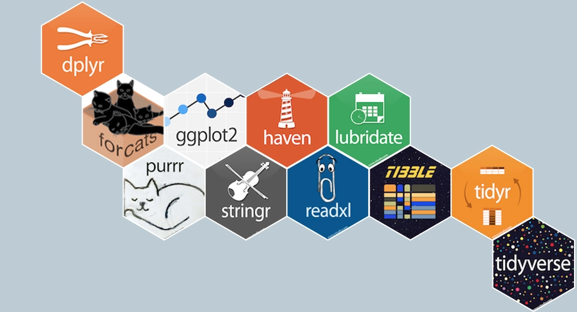
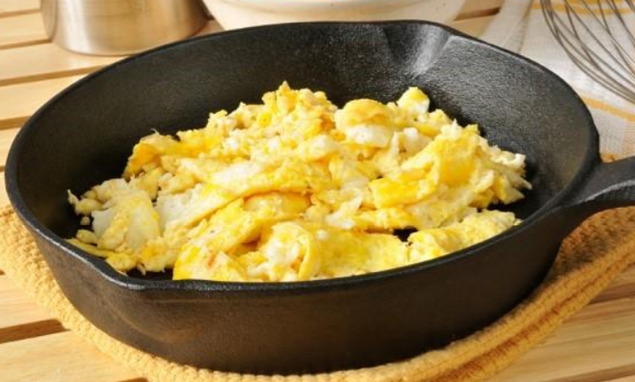
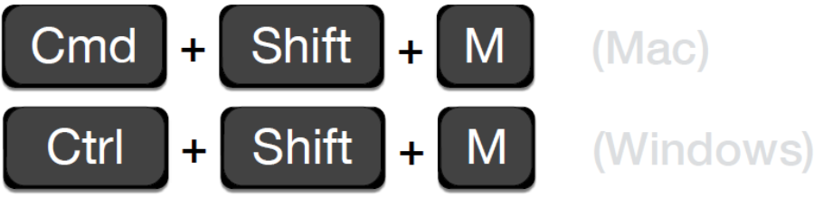
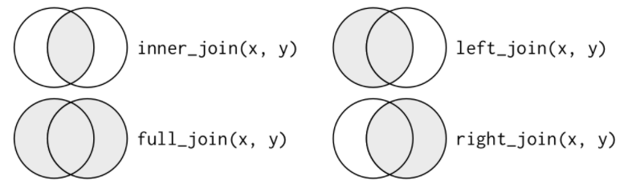
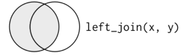
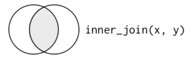

class: center, middle

.linea-superior[]
.linea-inferior[]


## Taller de R

## Validación y edición de datos

## Proyecto Estatégico de Servicios Compartidos

### agosto 2020

```{r setup, include=FALSE}
options(htmltools.dir.version = FALSE)
knitr::opts_chunk$set(message = FALSE) 
```

```{r xaringan-themer, include=FALSE, warning=FALSE}
library(xaringanthemer)
#style_duo_accent(
 # primary_color = "#1381B0",
  #secondary_color = "#FF961C",
  #inverse_header_color = "#FFFFFF"
#)
```

---
background-image: url("imagenes/fondo2.PNG")
background-size: contain;
background-position: 100% 0%

# Objetivo del taller

<br>
<br>
.center[

## *Entregar los conceptos necesarios para comprender el script de validación que veremos en la próxima sesión*
]

--

<br>
.center[
## Nos enfocaremos en tareas muy concretas, relacionadas con nuestro quehacer 
]
---
background-image: url("imagenes/fondo2.PNG")
background-size: contain;
background-position: 100% 0%

# Asumiremos algunas cosas

## Todos tienen algo de experiencia usando `R`

--

- Todos saben lo que es un script y han trabajado de esta forma 

--

- Han trabajado con `dataframes` 

--

- Todos han trabajado con datos de encuestas de hogares (Stata, SPSS, Python, Excel)

--


- Todos saben cómo funciona un ciclo for (en Stata, R, Python o lo que sea)

--

<br>

.center[
## Si no manejan alguno de estos conceptos, no se preocupen. Haremos lo posible para que nadie quede atrás 

]


---

background-image: url("imagenes/fondo2.PNG")
background-size: contain;
background-position: 100% 0%

# Contenidos de hoy

- Funciones básicas de `dplyr` para editar datos

--

- Encadenamiento de instrucciones

--

- Explicación (veloz) del objeto lista 

--

- Introducción a funcionales con `purrr` 

--

.center[
## El tiempo corre, así que manos a la obra
]

.center[

]

---

background-image: url("imagenes/fondo2.PNG")
background-size: contain;
background-position: 100% 0%

# ¿Qué es dplyr y tidyverse?

<br>

.center[

]

--

## Paquetes que comparten una filosofía

--

## Es importante limitarnos a este set de herramientas

---
background-image: url("imagenes/fondo2.PNG")
background-size: contain;
background-position: 100% 0%

# Diferencia entre dplyr y R base

Seleccionemos las mujeres mayores de 18 de una base de datos, conservando solo las columnas de sexo y edad

Con `R` base

```{r, eval=FALSE}
df <- datos[datos$sexo == 2 & datos$edad > 18, c("sexo", "edad")]
```


--

Con `dplyr`

```{r, eval=FALSE}
datos %>% 
  filter(sexo == 2 & edad > 18) %>% 
  select(sexo, edad)
```


--

Si cada uno de nosotros elige su propio estilo, la comunicación se hace muy difícil


---

background-image: url("imagenes/fondo2.PNG")
background-size: contain;
background-position: 100% 0%

# Principales funciones de dplyr

- `arrange`: ordena filas, usando algún criterio

- `filter`: selecciona filas, usando algún criterio

- `mutate`: crea variables a partir de las existentes

- `group_by`: agrupa filas, usando algún criterio (similar a bys de Stata)

- `summarise`: reduce cada grupo a una fila, mediante el cálculo de una medida agregada

- `joins`: une filas de distintas tablas, usando una llave (similar a merge de Stata)


---

background-image: url("imagenes/fondo2.PNG")
background-size: contain;
background-position: 100% 0%

# Principales funciones de dplyr

Haremos una serie de procedimientos para ordenar una base de datos

Lo primero que haremos es seleccionar a la subpoblación que nos interesa: **personas adultas ocupadas**

--

```{r}
library(tidyverse);library(haven)

personas <- read_dta("data/base-personas-viii-epf-(stata).dta")
names(personas) <- tolower(names(personas)) #dejar nombres en minúscula
ocup_adultos <- filter(personas, edad >= 18 & cae == 1 ) #<<
table(ocup_adultos$cae)

```

--

El primer argumento de `filter` es un `dataframe` (personas)

--

El segundo argumento es una condición (edad >= 18 & cae == 1 )

--

Noten que en `filter` las variables fueron llamadas sin el operador $ 

--

Podemos hacer la condición tan compleja como nosotros queramos

---
background-image: url("imagenes/fondo2.PNG")
background-size: contain;
background-position: 100% 0%

# Principales funciones de dplyr

Quiero estimar una ecuación de salarios y necesito la edad al cuadrado. 

También necesito construir los ingresos de la ocupación principal y una variable dummy para sexo, que valga 1 para los hombres y 0 para las mujeres

--

```{r}
ocup_adultos <-  mutate(ocup_adultos, 
                        edad2 = edad * edad, #alternativamente edad**2 o edad^2
                        ing = ingda_hd + ingdh_hd + ingnp_hd + ingdpi_hd,
                        sexo_d = if_else(sexo == 1, 1, 0)) 

```

--

Cada variable se va separando por comas

--

La función `if_else` opera de la misma manera que en excel 

--

Ahora me gustaría construir una base de datos más compacta, solo con algunas columnas

```{r}
ocup_adultos <- select(ocup_adultos, edad, edad2, sexo, ing, eduactual)
```

--

Finalmente, quiero ordenar los datos de menor a mayor, según edad

```{r}
ocup_adultos <- arrange(ocup_adultos, desc(edad))
```

---
background-image: url("imagenes/fondo2.PNG")
background-size: contain;
background-position: 100% 0%

# Principales funciones de dplyr

Ahora que tengo mis datos más o menos ordenados, quiero explorar un poco las variables 

```{r}
summarise(ocup_adultos, 
          media_edad = mean(edad), 
          media_ing = mean(ing))
```

La función `summarise` compacta los datos en una fila, usando alguna función  

--

Debemos entender el nombre de manera literal, es decir, resumir 

--

.discussion[
Todas las funciones de `dplyr` tienen como primer argumento un `dataframe` y luego la instrucción específica 
]

---
background-image: url("imagenes/fondo2.PNG")
background-size: contain;
background-position: 100% 0%

# Principales funciones de dplyr

## Uniendo todo...

```{r, eval=F}
ocup_adultos <- filter(personas, edad >= 18 & cae == 1 ) 
table(ocup_adultos$cae)
ocup_adultos <-  mutate(ocup_adultos, 
                   edad2 = edad * edad, #alternativamente edad**2 o edad^2
                   ing = ingda_hd + ingdh_hd + ingnp_hd + ingdpi_hd,
                   sexo_d = if_else(sexo == 1, 1, 0)) 
ocup_adultos <- select(ocup_adultos, edad, edad2, sexo, ing, eduactual)
ocup_adultos <- arrange(ocup_adultos, desc(edad))
summarise(ocup_adultos, media_edad = mean(edad), 
          media_ing = mean(ing))

```

--

.discussion[

Esta sucesión de pasos funciona, sin embargo, no es la forma en la que usualmente trabajamos con `dplyr`

En internet no es común ver este tipo de código
]

---
background-image: url("imagenes/fondo2.PNG")
background-size: contain;
background-position: 100% 0%

# Encadenamiento de funciones

El operador `%>%` (*pipe*) se usa para concatenar funciones

Usamos los (¿las?) *pipes* para pasar información de un proceso a otro

--

```{r, eval=F}
ocup_adultos <- personas %>% 
  filter(edad >= 18 & cae == 1 ) %>% #<<
  mutate(edad2 = edad * edad, 
         ing = ingda_hd + ingdh_hd + ingnp_hd + ingdpi_hd,
         sexo_d = if_else(sexo == 1, 1, 0)) %>%
  select(edad, edad2, sexo, ing, eduactual) %>%
  arrange(desc(edad))
```
--

Filtramos con `filter`

---
background-image: url("imagenes/fondo2.PNG")
background-size: contain;
background-position: 100% 0%

# Encadenamiento de funciones

El operador `%>%` (*pipe*) se usa para concatenar funciones

Usamos los (¿las?) *pipes* para pasar información de un proceso a otro

```{r}
ocup_adultos <- personas %>% 
  filter(edad >= 18 & cae == 1 ) %>% 
  mutate(edad2 = edad * edad, #<<
         ing = ingda_hd + ingdh_hd + ingnp_hd + ingdpi_hd, #<<
         sexo_d = if_else(sexo == 1, 1, 0)) %>% #<<
  select(edad, edad2, sexo, ing, eduactual) %>% 
  arrange(desc(edad))

```

Filtramos con `filter`

Creamos variables con `mutate`

---

background-image: url("imagenes/fondo2.PNG")
background-size: contain;
background-position: 100% 0%

# Encadenamiento de funciones

El operador `%>%` (*pipe*) se usa para concatenar funciones

Usamos los (¿las?) *pipes* para pasar información de un proceso a otro

```{r}
ocup_adultos <- personas %>% 
  filter(edad >= 18 & cae == 1 ) %>% 
  mutate(edad2 = edad * edad, 
         ing = ingda_hd + ingdh_hd + ingnp_hd + ingdpi_hd,
         sexo_d = if_else(sexo == 1, 1, 0)) %>%
  select(edad, edad2, sexo, ing, eduactual) %>% #<<
  arrange(desc(edad))

```

Filtramos con `filter`

Creamos variables con `mutate`

Seleccionamos variables con `select`

---
background-image: url("imagenes/fondo2.PNG")
background-size: contain;
background-position: 100% 0%

# Encadenamiento de funciones

El operador `%>%` (*pipe*) se usa para concatenar funciones

Usamos los (¿las?) *pipes* para pasar información de un proceso a otro

```{r}
ocup_adultos <- personas %>% 
  filter(edad >= 18 & cae == 1 ) %>% 
  mutate(edad2 = edad * edad, 
         ing = ingda_hd + ingdh_hd + ingnp_hd + ingdpi_hd,
         sexo_d = if_else(sexo == 1, 1, 0)) %>%
  select(edad, edad2, sexo, ing, eduactual) %>% 
  arrange(desc(edad)) #<<

```

Filtramos con `filter`

Creamos variables con `mutate`

Seleccionamos variables con `select`

Ordenamos  con `arrange`


---
background-image: url("imagenes/fondo2.PNG")
background-size: contain;
background-position: 100% 0%

# ¿Cómo funcionan los pipes?

Podemos pensar en una secuencia de acciones:

.pull-left[
1. Sacar huevos del refigerador
2. Poner huevos en la sartén con aceite
3. Prender fuego
4. Revolver huevos
5. Comer

]

.pull-right[

]

--

Expresado en pseudo código

```{r, eval=F}
comer(revolver(prender_fuego(poner_ensarten(sacar("huevos"), con = "aceite"))))
```

--

Expresado con *pipes*

```{r, eval=F}
sacar("huevos") %>% 
  poner_ensarten(con = "aceite") %>% 
  prender_fuego() %>% 
  revolver() %>% 
  comer()
```
---
background-image: url("imagenes/fondo2.PNG")
background-size: contain;
background-position: 100% 0%

# Un poco más sobre los pipes


Los *pipes* sirven para que nuestro código sea mucho más legible

--

Por una cuestión de estilo y legibilidad es deseable escribir las funciones hacia abajo


```{r, eval = F}
personas %>% 
  filter(edad >= 18 & cae == 1 ) %>% 
  select(edad, cae)
```


```{r, eval=F}
personas %>% filter(edad >= 18 & cae == 1 ) %>% select(edad, cae)
```

--
.center[

]

---
background-image: url("imagenes/fondo2.PNG")
background-size: contain;
background-position: 100% 0%

# Ahora les toca a ustedes

Carguen la base de personas
```{r}
library(tidyverse);library(haven)
personas <- read_dta("data/base-personas-viii-epf-(stata).dta")
names(personas) <- tolower(names(personas)) #dejar nombres en minúscula
```

Intenten concatenar las siguientes instrucciones

1. Filtrar solo a los hombres
2. Crear una variable llamada joven que valga 1 si la persona es menor o igual 35 y 0, si es mayor.
3. Seleccionar las siguientes variables: folio, edad, joven
4. Asignar todo eso a un nuevo objeto llamado df

Deberían basarse en el código de la lámina anterior

--
```{r, eval=F}
df <- personas %>% 
  filter(sexo == 1) %>% 
  mutate(joven = if_else(edad <= 35, 1, 0)) %>% 
  select(folio, edad, joven)
```

---
background-image: url("imagenes/fondo2.PNG")
background-size: contain;
background-position: 100% 0%

# Principales funciones de dplyr

En encuestas de hogares, usualmente queremos construir valores a nivel de hogar. Por ejemplo, **ingreso total**

--

Para ello, usamos la función `group_by`

--

.pull-left[

]

.pull-right[

- Primero `group_by` divide el *data frame*.

- Luego opera una función con la data fragmentada.

- Finalmente `group_by` vuelve a combinar los resultados.
]

--

```{r}
df <- personas %>% 
  mutate(ing = ingda_hd + ingdh_hd + ingnp_hd + ingdpi_hd) %>% 
  group_by(folio) %>% #<<
  mutate(ing_hog = sum(ing)) #<<
```
--

Todo lo que hagamos después de `group_by` va a ejecutarse sobre dicha agregación

---
background-image: url("imagenes/fondo2.PNG")
background-size: contain;
background-position: 100% 0%

# Principales funciones de dplyr

Veamos otro ejemplo de `group_by`

--

Queremos calcular el ingreso promedio por hogar, según área de estimación

--

```{r}
personas %>% 
  mutate(ing = ingda_hd + ingdh_hd + ingnp_hd + ingdpi_hd) %>% 
  group_by(folio) %>% 
  mutate(ing_hog = sum(ing)) %>%  
  slice(1) %>% #<< 
  group_by(zona)  %>% #<< 
  summarise(media_zona = mean(ing_hog)) #<<
  
```

`slice` selecciona *n* filas de cada grupo. En este caso seleccionamos la primera

---
background-image: url("imagenes/fondo2.PNG")
background-size: contain;
background-position: 100% 0%

# Ahora les toca a ustedes

Usando la base de personas, calculemos la edad promedio, según sexo y zona. Para ello deben:

1. Agrupar
2. Calcular media

**Pista**: la función `group_by` puede recibir *n* variables

--

```{r, eval=T}
personas %>% 
  group_by(sexo, zona) %>% 
  summarise(edad_media = mean(edad))
```


---

background-image: url("imagenes/fondo2.PNG")
background-size: contain;
background-position: 100% 0%

# Principales funciones de dplyr

## Una tarea muy común es unir tablas  

--

No queremos que nos vaya a pasar...

.center[

]

--

O esto...


.center[

]


---
background-image: url("imagenes/fondo2.PNG")
background-size: contain;
background-position: 100% 0%

# Familia join

--

.pull-left[

- `left_join`

- `right_join`

- `inner_join`

- `full_join`

- otros más

]

.pull-right[

]

--

Nosotros veremos únicamente `left_join` e `inner_join`, pero les recomiendo mucho revisar los otros tipos


---

background-image: url("imagenes/fondo2.PNG")
background-size: contain;
background-position: 100% 0%

# Familia join (left_join)

.pull-left[
.discussion[
Conserva todas las filas de la base "de la izquierda"

Excluye las filas del lado derecho que no hagan *match* 
]
]

.pull-right[

]

--

Vamos a crear una base ficticia que esté a nivel de hogares
```{r}
hogares <- personas %>% 
  group_by(folio) %>% 
  slice(1) %>% 
  select(folio, ing_total_hog_hd) 

head(hogares, 2)
```

---
background-image: url("imagenes/fondo2.PNG")
background-size: contain;
background-position: 100% 0%

# Familia join (left_join)


```{r}
personas2 <- personas %>% 
  left_join(hogares, by = "folio")
```

- Primer argumento: `dataframe` "de la izquerda"

- Segundo argumento: `dataframe` "de la derecha"

- Tercer argumento: llave que permite la unión

--

**Ojo**: cuando 2 columnas tienen el mismo nombre en ambas tablas, R agrega un sufijo

```{r, echo=F,highlight.output =  c(2)}
personas2 %>% 
  select(folio, starts_with("ing_total_hog_hd.")) %>% 
  slice(1:2)
```


---
background-image: url("imagenes/fondo2.PNG")
background-size: contain;
background-position: 100% 0%

# Familia join (left_join)

Vamos a agregar nuevos registros a la tabla de la derecha y hacemos `left_join`

--

```{r, results="hide"}
hogares_alterado <- hogares %>% 
  bind_rows(data.frame(folio = c("99999999999-1", "999999999999-99"), 
                       ing_total_hog_hd = c(1, 2)))

personas2 <- personas %>% 
  left_join(hogares_alterado, by = "folio")

dim(personas2)[1]
dim(personas)[1]

```

¿personas2 y personas tendrán igual o distinto número de filas?

--

```{r, echo=F}
dim(personas2)[1]
dim(personas)[1]
```

--

Seguimos teniendo la misma cantidad de filas 

`left_join` descarta los registros de la derecha que no hacen match

---
background-image: url("imagenes/fondo2.PNG")
background-size: contain;
background-position: 100% 0%

# Familia join (inner_join)

.pull-left[
.discussion[

`inner_join` conserva solo las filas que coinciden en ambas tablas 

Es posible que las filas de la tabla final no coincida con ninguna de las originales 

]
]
.pull-right[

]

--

Vamos a seleccionar aleatoriamente filas de ambas tablas
```{r}
set.seed(123)
hogares_alterado <- hogares %>%
  ungroup() %>% 
  slice_sample(prop = 0.5)
set.seed(123)  
personas_alterado <- personas %>% 
  ungroup() %>% 
  slice_sample(prop = 0.5)

l1 <- length(unique(hogares_alterado$folio))
l2 <- length(unique(personas_alterado$folio))
c(l1, l2)

```
---
background-image: url("imagenes/fondo2.PNG")
background-size: contain;
background-position: 100% 0%

# Familia join (inner_join)

Hacemos `inner_join` para ver qué ocurre

```{r}
personas2 <- personas_alterado %>% 
  inner_join(hogares_alterado, by = "folio")

length(unique(personas2))
```

--

Solo 248 hogares se mantienen en la tabla final

--

**Recomendación**: inner_join es un poco lento. Se puede reemplazar por `left_join` y `filter`

---
.linea-superior[]
.linea-inferior[]


## Algunas referencias para seguir aprendiendo  `dplyr`

- [R for data science](https://r4ds.had.co.nz/relational-data.html) (disponible en español)

- [Torpedos](https://rstudio.com/resources/cheatsheets/) (varios tópicos)

- [Statistical Inference via Data Science](https://moderndive.com/3-wrangling.html) 

- Para cosas puntuales usen [stackoverflow](https://es.stackoverflow.com/) en inglés

--

Sugerencia para *googlear*: "data wrangling dplyr"

---

background-image: url("imagenes/fondo2.PNG")
background-size: contain;
background-position: 100% 0%

# Ejercicios para aplicar dplyr

Usando la base de personas y gastos de la VIII EPF:

1. Calculen el gasto promedio de los hogares por división y zona (deben quedar dos filas por cada división)
2. Calculen la suma del gasto por hogar en la división 1 (debe quedar una observación por hogar)
3. Unir el gasto calculado de la división 1 con la base de personas

--

**Nota**: en primera instancia, no se preocupen de los factores de expansión, pero si se animan, es un muy buen ejercicio hacer los cálculos considerando la expansión.

--

Para cumplir con la tarea, deberán usar casi todas las funciones que vimos hoy, en especial: `group_by`,
`summarise` y `left_join` 

--

Es posible que algunas partes no sean tan fáciles, pero no se rindan. Sufrir un rato tiene su recompensa.


---
.linea-superior[]
.linea-inferior[]

.texto_intermedio[
Pasemos a ver qué son las listas

]

.center[

]

---


---
background-image: url("imagenes/fondo2.PNG")
background-size: contain;
background-position: 100% 0%

# Aprendiendo sobre listas

Las listas son uno de los tipos de datos fundamentales en `R` 

--

Tienen una gran flexibilidad

--

Nos permiten almacenar datos de diferente tipo y longitud


```{r}
mi_lista <- list(c(1,2,3), "Mingus", personas)
length(mi_lista)
```
--
Podemos acceder a los elementos de nuestra lista a través de sus índices

--

¿Qué creen que va a devolver esta línea de código?

```{r, results='hide'}
mi_lista[[2]]
```
--
```{r, echo=FALSE}
mi_lista[[2]]
```

---
background-image: url("imagenes/fondo2.PNG")
background-size: contain;
background-position: 100% 0%

# Aprendiendo sobre listas

También podemos acceder a lo que sea que contengan los índices

```{r}
mi_lista[[1]][3]
```
--

Y además transformar los elementos dentro de la lista

```{r}
mi_lista[[1]][3] <- 99
mi_lista[[1]]
```

--

Para poner nombres a la lista podemos hacer lo siguiente

```{r}
names(mi_lista) <- c("uno", "dos", "tres")
mi_lista[["uno"]]
mi_lista$uno
```

---
background-image: url("imagenes/fondo2.PNG")
background-size: contain;
background-position: 100% 0%

# Introducción a funcionales con purrr

*To become significantly more reliable, code must become more transparent. In particular, nested conditions and loops must be viewed with great suspicion. Complicated control flows confuse programmers. Messy code often hides bugs.*

-Bjarne Stroustrup (creador de C++)

--

Las funcionales (functionals) son funciones que reciben como argumento otra función y devuelven un vector


```{r}
random <- function(f) f(runif(10))
random(mean)
```
--

.pull-left[

]

.pull-right[
Cuando vi esto por primera vez, me sentí así.
]


---
background-image: url("imagenes/fondo2.PNG")
background-size: contain;
background-position: 100% 0%

# Introducción a funcionales con purrr


¿Alguno de ustedes tiene una idea de qué hace este código?

```{r, eval=F}
for (i in 1:10) {
  print(i)
}
```

--

Si entienden este código, la mitad del camino está recorrido en nuestro estudio de las funcionales

 


---

class: center, middle

.linea-superior[]
.linea-inferior[]


## Gracias


